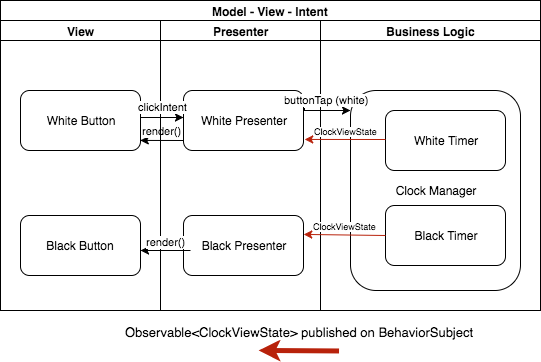

### GOOGLE PLAY

<https://play.google.com/store/apps/developer?id=John+Wilde>

### NOTES
Rewritten to use [Mosby](http://hannesdorfmann.com/android/mosby3-mvi-1) library for cleaner separation between views and business logic.

There are 3 presenters:
* `MainViewPresenter` which renders the play/pause button and the spinner
* `ClockViewPresenter` for responding to button taps and updating time
* `SoundViewPresenter` for playing button click and end-of-game buzzer

This diagram shows the MVI interactions for the `ClockView` portion of the app.
There are two `ClockFragment`s ("view"), one for white and one for black,
a `ClockViewPresenter` for each view, and the business logic. The business logic
has no knowledge of the view or Android classes - it consists of a`ClockManager` 
which holds two `TimerLogic` instances.  

When user hits a button the "intent" is forwarded through the presenter to the 
business logic.  For this view, if the user performed an invalid tap - e.g. at start
of game black player must tap button to kick things off - the presenter responsds 
with a Snackbar message instead of calling the method on the clock manager that would
start the game.  

While game is underway, each `TimerLogic` instance periodically generates new 
`ClockViewState`s (to show the time update) and publishes them on a `PublishSubject`
that the presenter has subscribed to.

I chose to put the generation of an error message in the presenter rather than 
the clock manager in order to keep the business logic purely concerned with actions
that change state of the game.

