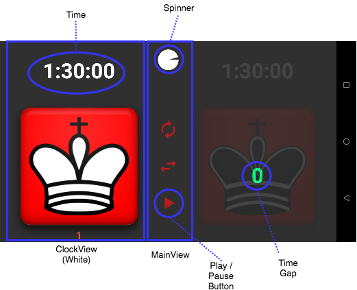

### GOOGLE PLAY

<https://play.google.com/store/apps/developer?id=John+Wilde>

### NOTES
Rewritten to use [Mosby](http://hannesdorfmann.com/android/mosby3-mvi-1) library for cleaner separation between views and business logic.

In this Chess Timer app there are two players (White and Black) and each player has a button they can tap.  A player taps his button to end his turn and start the other player's turn.  During a player's turn, their remaining time counts down, and the other player sees the time-gap on their view go up.  This diagram shows the important parts of the UI which includes two `ClockView` and one `MainView` component. 

There are 3 presenters:
* `MainViewPresenter` which renders the play/pause button and the spinner
* `ClockViewPresenter` for responding to button taps and updating time
* `SoundViewPresenter` for playing button click and end-of-game buzzer

This diagram shows the MVI interactions for the `ClockView` portion of the app. This view consists of a button the player can tap, a view that shows the time remaining and a view that shows the time difference between the clocks. The `ClockFragment` implements a simple interface which has just two methods: `clickIntent` and `render`.  `clickIntent` represents a touch by the user on the button indicating they intend to end their turn.  `render` receives updated `ClockViewModel` instances which the fragment will draw.

There is a `ClockViewPresenter` associated with each view. When user touches their button the "intent" is forwarded through the presenter to the business logic.  For this view, if the user performed an invalid tap (e.g., at the start of game the Black player must tap his button to kick things off) - the presenter responds with a Snackbar message instead of calling the method on the clock manager that would start the game.  I chose to put the generation of an error message in the presenter rather than the clock manager in order to keep the business logic purely concerned with actions that change state of the game.

The business logic layer has no knowledge of the view or Android classes - it consists of a`ClockManager` which holds two `TimerLogic` instances.  While a game is underway, each `TimerLogic` instance periodically generates a new 
`ClockViewState` to show the time update.  The new state is published using a `PublishSubject`that the presenter has subscribed to.
